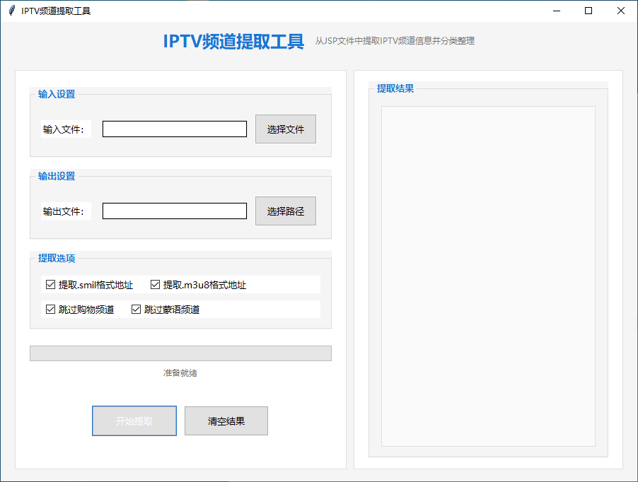

# China-Unicom-Hohhot-IPTV-list
## 内蒙古联通IPTV频道单播列表  
理论上内蒙古范围内联通固网、移动网均可使用

新增tvbox数据源（tvbox.json）和直播源（tvbox.txt），使用时在tvbox对应位置填写对应的raw地址

更新直播源为 **全部频道.csv** ，使用时另存为txt文件。

## 自己抓取频道 （利用AI写的小工具，仅限内蒙古联通）

1. 参考 [抓包教程](https://zhuanlan.zhihu.com/p/673395068) 抓取 **getchannellistHWCU.jsp** 文件
2. 下载频道提取工具 （Releases） 输入getchannellistHWCU.jsp文件  自动生成全部频道.csv

